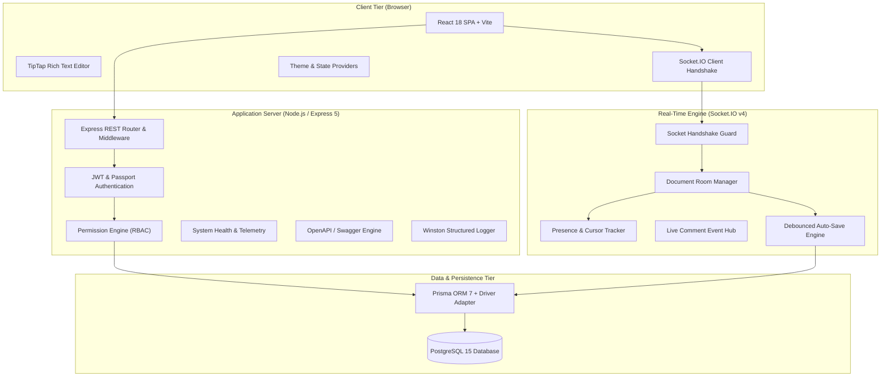

# System Architecture & Technical Specification

## Overview

The Collaborative Document Platform is built as a high-performance, resilient, multi-tenant real-time editing workspace. It decouples state management, document persistence, authorization enforcement, and event propagation across a modern, layered stack.

---

## 1. System Topology

---

## 2. Layered Architecture Breakdown

### 2.1 Presentation & Editor Layer (`frontend/`)
- **React 18 + Vite**: SPA framework providing ultra-fast HMR and optimized production bundles.
- **TipTap v2 Core**: Headless, PM (ProseMirror)-based rich-text editing engine supporting H1–H6 headings, lists, blockquotes, code formatting, hyperlinks, text alignment, and undo history.
- **Context Providers**:
  - `AuthContext`: Manages JWT access tokens, refresh token rotation, and current user profile state.
  - `SocketContext`: Encapsulates Socket.IO connection lifecycle, auto-reconnection, and room subscriptions.
  - `ThemeContext`: Toggles Light / Dark / System modes with local storage persistence and system preference detection.

### 2.2 API & Middleware Layer (`src/routes`, `src/controllers`, `src/middleware`)
- **Express 5 Framework**: Handles HTTP REST requests for Auth, Document CRUD, Revision History, Sharing, Comments, Search, and Exports.
- **Helmet & Rate Limiting**: Security headers enabled; auth endpoints protected by `express-rate-limit` (100 requests per 15-minute window).
- **Zod Validation**: Strict request payload schema validation guarding against injection and invalid parameters.
- **Winston Logger**: Centralized structured logging emitting JSON formatted traces in production and colorized logs in development.

### 2.3 Real-Time Collaboration Engine (`src/socket`, `src/presence`)
- **Socket.IO v4**: Manages full-duplex WebSocket connections with fallback to HTTP long-polling.
- **Room Isolation**: Each document operates in an isolated `document:{id}` room.
- **Debounced Save Protocol**:
  - Edits in editor trigger immediate WebSocket broadcasts to room members.
  - Changes are cached in memory and flushed to PostgreSQL after 1.5 seconds of inactivity.
  - On socket disconnect or browser unload, pending changes flush immediately.
- **Presence & Awareness Store**: In-memory store maintaining collaborator lists, active cursor positions, live text selections, and typing status with 2.5s auto-expiration.

### 2.4 Authorization & RBAC Engine (`src/services/permission.service.js`)
Single source of truth for all access control decisions across both REST and WebSockets.

| Role | Read | Comment | Edit | Share | Delete / Restore |
|---|:---:|:---:|:---:|:---:|:---:|
| **VIEWER** | ✅ | ❌ | ❌ | ❌ | ❌ |
| **COMMENTER** | ✅ | ✅ | ❌ | ❌ | ❌ |
| **EDITOR** | ✅ | ✅ | ✅ | ❌ | ❌ |
| **OWNER** | ✅ | ✅ | ✅ | ✅ | ✅ |

---

## 3. Key Data Flows

### 3.1 Collaborative Editing Flow
1. User A types in TipTap editor.
2. `useDocumentCollaboration` emits `DOC_UPDATE` event via Socket.IO.
3. Socket Room Guard verifies User A's `EDIT` permission using `PermissionService`.
4. Update is broadcast instantly to all other clients in `document:{id}` room.
5. `CollaborationService` schedules a 1.5s debounced write to PostgreSQL via Prisma.

### 3.2 Threaded Commenting Flow
1. User selects text snippet and submits comment.
2. REST request `POST /api/documents/:id/comments` validates `COMMENT` permission.
3. Database creates `CommentThread` and initial `Comment` records.
4. Socket engine broadcasts `COMMENT_CREATED` event to document room for live UI insertion.
5. Activity log and notifications are automatically generated for relevant collaborators.

---

## 4. Deployment Topology

The entire application is containerized via Docker and Docker Compose:
- **`nexusdocs-postgres`**: PostgreSQL 15 database container with persistent data volumes and health checks.
- **`nexusdocs-backend`**: Node 20 Alpine Express API server exposing port 5000.
- **`nexusdocs-frontend`**: Nginx static web server serving production Vite bundle on port 80 with single-page app route fallback.
