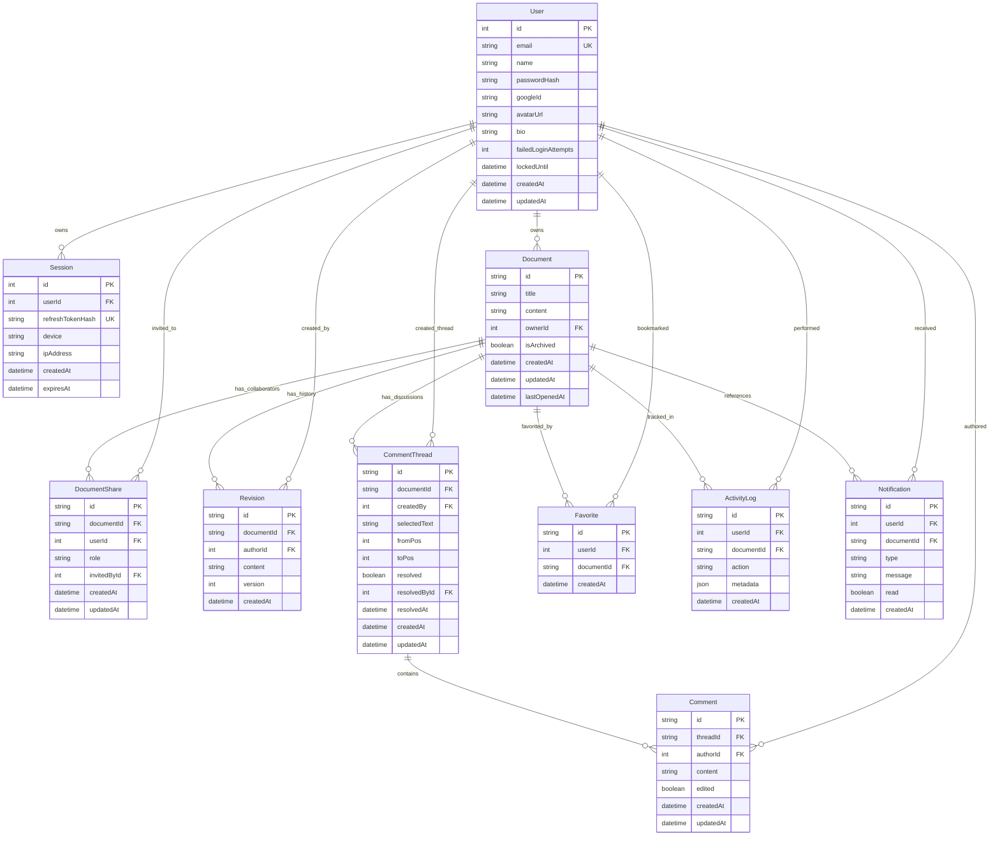

# Database Schema & Performance Specification

## Entity-Relationship Diagram

---

## Data Schema & Table Reference

### 1. `User`
Stores authenticated platform accounts.
- **Primary Key**: `id` (`Int`, auto-increment)
- **Unique Constraints**: `email`
- **Security Fields**: `passwordHash`, `failedLoginAttempts`, `lockedUntil`
- **Profile Fields**: `avatarUrl`, `bio`

### 2. `Session`
Stores active refresh token hashes for session management.
- **Primary Key**: `id` (`Int`, auto-increment)
- **Foreign Keys**: `userId` -> `User(id)` (`ON DELETE CASCADE`)
- **Unique Constraints**: `refreshTokenHash`

### 3. `Document`
Core workspace document entity.
- **Primary Key**: `id` (`UUID` string)
- **Foreign Keys**: `ownerId` -> `User(id)` (`ON DELETE CASCADE`)
- **Metadata Fields**: `isArchived` (soft delete), `lastOpenedAt`

### 4. `DocumentShare`
Role-Based Access Control junction table.
- **Primary Key**: `id` (`UUID` string)
- **Foreign Keys**:
  - `documentId` -> `Document(id)` (`ON DELETE CASCADE`)
  - `userId` -> `User(id)` (`ON DELETE CASCADE`)
  - `invitedById` -> `User(id)` (`ON DELETE SET NULL`)
- **Unique Constraints**: `[documentId, userId]` (prevents duplicate permissions)
- **Roles**: `VIEWER`, `COMMENTER`, `EDITOR`, `OWNER`

### 5. `Revision`
Snapshot version history tracking.
- **Primary Key**: `id` (`UUID` string)
- **Foreign Keys**: `documentId` -> `Document(id)` (`ON DELETE CASCADE`), `authorId` -> `User(id)`

### 6. `CommentThread` & `Comment`
Threaded contextual annotations.
- `CommentThread` contains range metadata (`selectedText`, `fromPos`, `toPos`) and resolution state.
- `Comment` contains actual nested messages linked to `CommentThread(id)`.

### 7. `Favorite`, `ActivityLog`, `Notification`
Productivity extensions supporting document bookmarking, user activity timeline logging, and notifications.

---

## Indexing & Performance Strategy

The database includes explicit indexes on all foreign key lookups and frequent filter criteria to maintain `<10ms` query response times under high workload:

| Model | Index Target | Query Optimization Target |
|---|---|---|
| `Session` | `[userId]` | Fast session validation during token refresh |
| `Document` | `[ownerId]` | User dashboard owned documents queries |
| `Document` | `[isArchived]` | Trash tab vs active documents filter |
| `Document` | `[updatedAt]`, `[lastOpenedAt]` | Sorting recent documents timeline |
| `DocumentShare` | `[userId]`, `[documentId]` | Fast RBAC access permission lookups |
| `Revision` | `[documentId]` | Fetching revision timeline for document |
| `CommentThread` | `[documentId]`, `[resolved]` | Fetching active/resolved discussions |
| `Favorite` | `[userId]`, `[documentId]` | Bookmarked documents lookup |
| `ActivityLog` | `[userId]`, `[createdAt]` | Pagination of user audit activity feed |
| `Notification` | `[userId]`, `[read]` | Unread notification counter badge |

---

## Cascade & Data Integrity Rules
- **Cascading Deletes**: When a `Document` is permanently deleted, all associated `DocumentShare`, `Revision`, `CommentThread`, `Favorite`, `ActivityLog`, and `Notification` rows are automatically cleaned up (`ON DELETE CASCADE`).
- **Orphan Prevention**: Foreign keys explicitly prevent orphan comments, unlinked revisions, or invalid user references.
